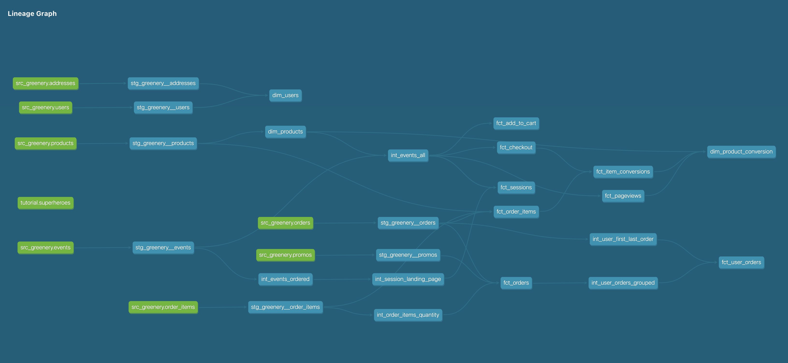

# PART 1: Create new models to answer the first two questions

**What is our overall conversion rate?**
62.45%

```
with session_counts as (
  select
    count(distinct case when tot_checkouts > 0 then session_guid end) as sessions_with_checkout
    ,count(distinct session_guid) as unique_sessions
  from dbt_christine_y.fct_sessions
)
select
  sessions_with_checkout/unique_sessions::decimal as conversion_rate
from session_counts
```

**What is our conversion rate by product?**
```
select
  product_name
  ,product_guid
  ,round(product_conversion_rate,4) as conversion_rate
from dbt_christine_y.dim_product_conversion
```


```
[
 {
  "conversion_rate": "0.3443",
  "product_guid": "4cda01b9-62e2-46c5-830f-b7f262a58fb1",
  "product_name": "Pothos"
 },
 {
  "conversion_rate": "0.5373",
  "product_guid": "689fb64e-a4a2-45c5-b9f2-480c2155624d",
  "product_name": "Bamboo"
 },
 {
  "conversion_rate": "0.4839",
  "product_guid": "55c6a062-5f4a-4a8b-a8e5-05ea5e6715a3",
  "product_name": "Philodendron"
 },
 {
  "conversion_rate": "0.5102",
  "product_guid": "be49171b-9f72-4fc9-bf7a-9a52e259836b",
  "product_name": "Monstera"
 },
 {
  "conversion_rate": "0.6094",
  "product_guid": "fb0e8be7-5ac4-4a76-a1fa-2cc4bf0b2d80",
  "product_name": "String of pearls"
 },
 {
  "conversion_rate": "0.5397",
  "product_guid": "b66a7143-c18a-43bb-b5dc-06bb5d1d3160",
  "product_name": "ZZ Plant"
 },
 {
  "conversion_rate": "0.3973",
  "product_guid": "e8b6528e-a830-4d03-a027-473b411c7f02",
  "product_name": "Snake Plant"
 },
 {
  "conversion_rate": "0.4533",
  "product_guid": "c7050c3b-a898-424d-8d98-ab0aaad7bef4",
  "product_name": "Orchid"
 },
 {
  "conversion_rate": "0.4231",
  "product_guid": "bb19d194-e1bd-4358-819e-cd1f1b401c0c",
  "product_name": "Birds Nest Fern"
 },
 {
  "conversion_rate": "0.5094",
  "product_guid": "b86ae24b-6f59-47e8-8adc-b17d88cbd367",
  "product_name": "Calathea Makoyana"
 },
 {
  "conversion_rate": "0.4091",
  "product_guid": "e5ee99b6-519f-4218-8b41-62f48f59f700",
  "product_name": "Peace Lily"
 },
 {
  "conversion_rate": "0.4500",
  "product_guid": "05df0866-1a66-41d8-9ed7-e2bbcddd6a3d",
  "product_name": "Bird of Paradise"
 },
 {
  "conversion_rate": "0.5000",
  "product_guid": "e706ab70-b396-4d30-a6b2-a1ccf3625b52",
  "product_name": "Fiddle Leaf Fig"
 },
 {
  "conversion_rate": "0.4265",
  "product_guid": "843b6553-dc6a-4fc4-bceb-02cd39af0168",
  "product_name": "Ficus"
 },
 {
  "conversion_rate": "0.4746",
  "product_guid": "5b50b820-1d0a-4231-9422-75e7f6b0cecf",
  "product_name": "Pilea Peperomioides"
 },
 {
  "conversion_rate": "0.3934",
  "product_guid": "58b575f2-2192-4a53-9d21-df9a0c14fc25",
  "product_name": "Angel Wings Begonia"
 },
 {
  "conversion_rate": "0.4783",
  "product_guid": "a88a23ef-679c-4743-b151-dc7722040d8c",
  "product_name": "Jade Plant"
 },
 {
  "conversion_rate": "0.5556",
  "product_guid": "74aeb414-e3dd-4e8a-beef-0fa45225214d",
  "product_name": "Arrow Head"
 },
 {
  "conversion_rate": "0.4925",
  "product_guid": "5ceddd13-cf00-481f-9285-8340ab95d06d",
  "product_name": "Majesty Palm"
 },
 {
  "conversion_rate": "0.4746",
  "product_guid": "64d39754-03e4-4fa0-b1ea-5f4293315f67",
  "product_name": "Spider Plant"
 },
 {
  "conversion_rate": "0.4643",
  "product_guid": "d3e228db-8ca5-42ad-bb0a-2148e876cc59",
  "product_name": "Money Tree"
 },
 {
  "conversion_rate": "0.5455",
  "product_guid": "c17e63f7-0d28-4a95-8248-b01ea354840e",
  "product_name": "Cactus"
 },
 {
  "conversion_rate": "0.4889",
  "product_guid": "35550082-a52d-4301-8f06-05b30f6f3616",
  "product_name": "Devil's Ivy"
 },
 {
  "conversion_rate": "0.4118",
  "product_guid": "6f3a3072-a24d-4d11-9cef-25b0b5f8a4af",
  "product_name": "Alocasia Polly"
 },
 {
  "conversion_rate": "0.4189",
  "product_guid": "80eda933-749d-4fc6-91d5-613d29eb126f",
  "product_name": "Pink Anthurium"
 },
 {
  "conversion_rate": "0.4677",
  "product_guid": "37e0062f-bd15-4c3e-b272-558a86d90598",
  "product_name": "Dragon Tree"
 },
 {
  "conversion_rate": "0.4923",
  "product_guid": "615695d3-8ffd-4850-bcf7-944cf6d3685b",
  "product_name": "Aloe Vera"
 },
 {
  "conversion_rate": "0.5185",
  "product_guid": "579f4cd0-1f45-49d2-af55-9ab2b72c3b35",
  "product_name": "Rubber Plant"
 },
 {
  "conversion_rate": "0.4000",
  "product_guid": "e18f33a6-b89a-4fbc-82ad-ccba5bb261cc",
  "product_name": "Ponytail Palm"
 },
 {
  "conversion_rate": "0.4127",
  "product_guid": "e2e78dfc-f25c-4fec-a002-8e280d61a2f2",
  "product_name": "Boston Fern"
 }
]
```

**A question to think about: Why might certain products be converting at higher/lower rates than others? Note: we don't actually have data to properly dig into this, but we can make some hypotheses.**

Product price, item discoverability (ex. promoted on homepage), quality of product images & descriptions


# PART 3: We’re starting to think about granting permissions to our dbt models in our postgres database so that other roles can have access to them.

Add a post hook to your project to apply grants to the role “reporting”. Create reporting role first by running CREATE ROLE reporting in your database instance.

To check if your grants worked as expected, you can query the information schema like this (inputing the table name you want to check): 

SELECT grantee, privilege_type
FROM information_schema.role_table_grants
WHERE table_name='mytable'

# PART 4:  After learning about dbt packages, we want to try one out and apply some macros or tests.

Install a package (i.e. dbt-utils, dbt-expectations) and apply one or more of the macros to your project

# PART 5: After improving our project with all the things that we have learned about dbt, we want to show off our work!

**Show (using dbt docs and the model DAGs) how you have simplified or improved a DAG using macros and/or dbt packages.**
NEW DAG:


OLD DAG:


# Reflection
**Which macros did you use?**
- dbt-utils
    -group_by
    -surrogate_key
    -get_query_results_as_dict
    
**Which packages did you install?**
-dbt-utils

**What was most challenging/surprising in completing this week's project?**
It was difficult to think of new custom macros that might be useful. I attempted to write one to simplify a few CTEs in my int_user_first_last_order model but I couldn't get it to work. I'll definitely want to spend more time thinking through macros next week! Also didn't have that much time to look through the macros in dbt-utils or at other packages, I think spending more time looking through those examples will be helpful

**What are you most proud of about your project?**
I really enjoyed the process this week and seeing the incremental improvements to the project, I definitely felt I'm getting better at identifying ways to improve the organization & structure of my initial models, and I have a better understanding now of intermediate models and how useful they are.